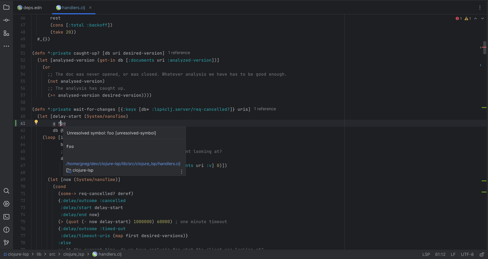

# clojure-lsp-intellij

<!-- Plugin description -->

[Free OpenSource Intellij plugin](https://github.com/clojure-lsp/clojure-lsp-intellij) with support for Clojure & ClojureScript development via the built-in Language Server (LSP) [clojure-lsp](https://clojure-lsp.io/) providing features via static analysis

<!-- Plugin description end -->

---

  <a href="https://clojure-lsp.io"><strong>homepage</strong></a> •
  <a href="doc/capabilities.md"><strong>capabilities</strong></a> •
  <a href="doc/developing.md"><strong>developing</strong></a> •
  <!-- <a href="https://clojure-lsp.io/features/"><strong>features</strong></a> • -->
  <!-- <a href="https://clojure-lsp.io/settings"><strong>settings</strong></a> • -->
  <!-- <a href="https://clojure-lsp.io/troubleshooting"><strong>troubleshooting</strong></a> • -->
  <a href="https://github.com/sponsors/clojure-lsp"><strong>support us</strong></a>

## Rationale

IntelliJ is the only mainstream editor without a plugin with good, free, and dedicated support for LSP, there are already excellent plugins for Clojure like [Cursive](https://cursive-ide.com/) which provides lots of features with REPL support or [ClojureKit](https://github.com/gregsh/Clojure-Kit) which adds basic Clojure support for the language, but none uses clojure-lsp or follows the LSP standard which some users may prefer as [some features](https://clojure-lsp.io/features/) are only available in clojure-lsp.

Keep in mind that this plugin provides only LSP features relying on clojure-lsp (and clj-kondo under the hood) static analysis, so no runtime features exist, like REPL integration or support, for that a separated plugin is needed as it's not possible to use only the REPL part of other plugins like Cursive together with this plugin.

Also, this plugin does not use IntelliJ's LSP support yet for 2 reasons:
  - The LSP feature is only available for Ultimate Edition (paid edition), making this plugin only available for those editions.
  - The LSP feature is pretty alpha, missing some features yet, some that were already implemented in this plugin.

---

## Contributing

Contributions are very welcome, check the [issues page](https://github.com/clojure-lsp/clojure-lsp-intellij/issues) for more information about what are good first issues or open an issue describing the desired support.

## Support the project 💙

You can help us keep going and improving clojure-lsp-intellij by **[supporting the project](https://github.com/sponsors/clojure-lsp)**, the support helps to keep the project going, updated, and maintained.

