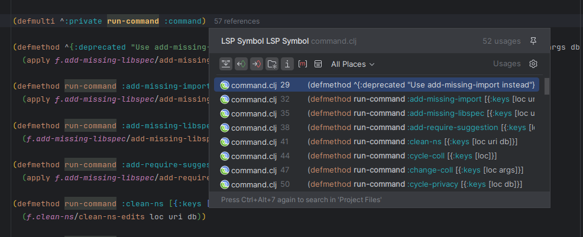

# Features

This plugin relies on [clojure-lsp](https://clojure-lsp.io/) features and [lsp4ij](https://github.com/redhat-developer/lsp4ij), so most work is done there, for more detailed information about all clojure-lsp features, check the [server documentation](https://clojure-lsp.io/features/).

### Find a function/var definition

> <kbd>Ctrl/Cmd</kbd> + <kbd>b</kbd> or <kbd>Ctrl/Cmd</kbd> + <kbd>click</kbd>

### Find all references of a function, var, keyword or namespace alias

> <kbd>Ctrl</kbd> + <kbd>Alt</kbd> + <kbd>h</kbd>

### Find all implementations of a defmulti or defprotocol

> <kbd>Ctrl/Cmd</kbd> + <kbd>Alt</kbd> + <kbd>g</kbd>

### Rename

> <kbd>Shift</kbd> + <kbd>F6</kbd>

### Documentation and clojuredocs integration

> <kbd>Ctrl/Cmd</kbd> + <kbd>Q</kbd> or mouse hover

### Completion

> <kbd>Ctrl/Cmd</kbd> + <kbd>SPC</kbd>

### Code lenses showing symbol references

### Diagnostics (linter)

### Format a whole file or range

> <kbd>Ctrl/Cmd</kbd> + <kbd>Alt</kbd> + <kbd>l</kbd>

### Call hierarchy

> <kbd>Ctrl</kbd> + <kbd>Alt</kbd> + <kbd>h</kbd>

### Document symbols

> <kbd>Ctrl/Cmd</kbd> + <kbd>F12</kbd>

### Wizard to create new Clojure projects

### Code actions

> <kbd>Alt</kbd> + <kbd>Enter</kbd>

#### Clean namespaces (Organize/Optimize imports)

> <kbd>Ctrl/Cmd</kbd> + <kbd>Alt</kbd> + <kbd>o</kbd>

#### Paredit

##### Forward slurp

> <kbd>Alt</kbd> + <kbd>]</kbd>

##### Forward barf

> <kbd>Alt</kbd> + <kbd>[</kbd>

##### Backward slurp

> <kbd>Alt</kbd> + <kbd>Shift</kbd> + <kbd>]</kbd>

##### Backward barf

> <kbd>Alt</kbd> + <kbd>Shift</kbd> + <kbd>[</kbd>

##### Raise sexpr

> <kbd>Alt</kbd> + <kbd>r</kbd>

##### Kill sexpr

> <kbd>Alt</kbd> + <kbd>k</kbd>

