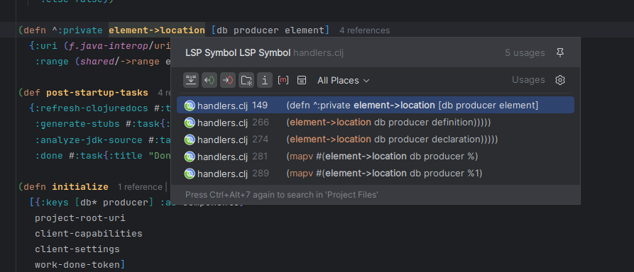
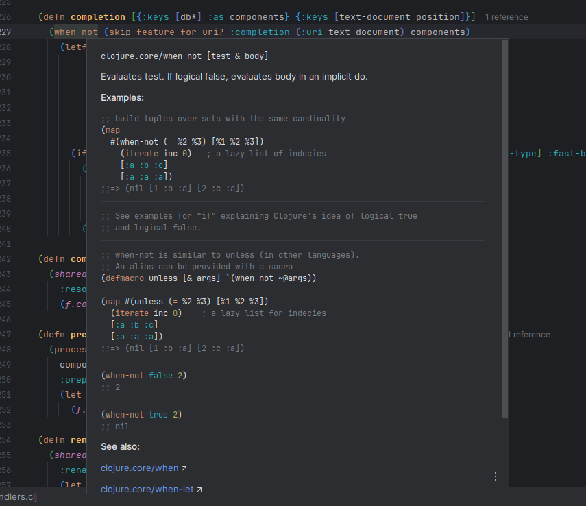

# Features

This plugin relies on clojure-lsp features, so most work is done there, for more detailed information about all clojure-lsp features, check the [server documentation](https://clojure-lsp.io/features/).

### Find a function/var definition

### Find all references of a function, var, keyword or namespace alias

### Rename

### Documentation and clojuredocs integration

### Completion

### Code actions

### Code lenses showing symbol references

### Diagnostics (linter)

### Format a whole file or range

### Wizard to create new Clojure projects

